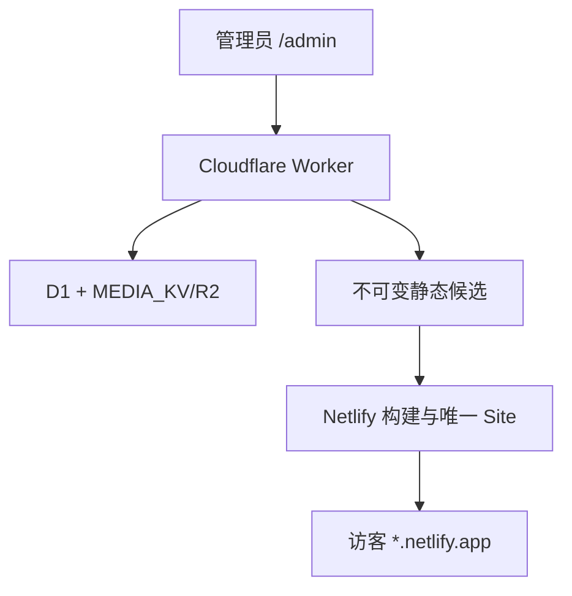

# 学生作品展示 v1.3.1-b 固定静态网站发布正式规划

> 版本：`1.3.1-b` / `v1.3.1-b`  
> 文件版本：`2`  
> 修改时间：`2026-09-01T13:19:34Z`（北京时间 `2026-09-01 21:19:34`）  
> 修订依据：`AUD-20260901-STATIC-PLAN-001`  
> 日期：2026-09-01  
> 角色：1（超级规划）  
> 状态：四项阻断修订完成，等待 2 仅复核 `B-01` 至 `B-04`  
> 仓库：`q1433031046-ship-it/student-portfolio-cloudflare`

## 一句话结论

`v1.3.1-b` 应新增一条“Worker 管理后台 + D1/KV/R2 事实源 + 每名学生独立 Netlify 账号中的唯一固定 Site”发布链：后台把一次内容修订冻结成不可变候选，只生成一个原子 draft Deploy，经不可变 permalink 验证后把同一 `deploy_id` 提升到固定 `*.netlify.app` 地址；公开站只读取随部署打包的静态文件，运行时不调用 Worker、D1、KV/R2 或 `/api/*`，失败时继续保留上一成功 Deploy、固定链接和固定二维码。

## 本轮审计修订记录

本文件只修复 `AUD-20260901-STATIC-PLAN-001` 的四个阻断项：

| 阻断项 | 修改位置 | 收敛结果 |
|---|---|---|
| `B-01` | 4.1–4.3、Task 0、Task 12、17.1、20 | G0 由 3 经保护 PR/自动检查合入，不单独交 2；唯一 Candidate 审计同时核对 G0 基线与 merge SHA |
| `B-02` | 7.1–7.3、8.2、Task 2、14 | 旧发布来源保持 `NULL/legacy source unknown`；静态 `public_revision` 从 0 独立计数 |
| `B-03` | 6.3、7.3、8.4、11.3、Task 4 | 一次性 bootstrap 兑换同 Job/generation 有界租约；覆盖排队、多媒体、Range、重试和撤销 |
| `B-04` | 6.1、6.3、7.2–7.4、8–9、Task 5–7、14、16–17、20 | 只构建一个 draft Deploy，以完整制品证据验证并发布同一 `deploy_id`；响应丢失不重复创建 |

其余已通过内容保持冻结。

## 1. 已冻结的产品决策

| 决策 | 正式口径 |
|---|---|
| 专项版本 | `1.3.1-b`，标签 `v1.3.1-b`，小写 `b` 表示 Track B |
| 原 `1.3.1` | 继续搁置；不删除、不改名、不合并、不修改其任何既有 Candidate/PR/记录 |
| 账号归属 | 每名学生独立 Netlify 账号/团队，额度与故障隔离 |
| Site 数量 | 每名学生每个作品站仅一个正式 Netlify Site |
| 固定地址 | 第一次成功发布后冻结该 Site 的 `*.netlify.app` 生产地址；禁止重建 Site、改 slug 或换 URL |
| 固定二维码 | 仅由已验证的固定生产 URL 派生；第一次成功前不显示；后续发布不变 |
| 后台 | 原 Cloudflare Worker 保留，继续承担登录、编辑、上传、发布控制和审计 |
| 数据事实源 | D1 保存草稿、发布状态和任务；KV/R2 保留后台媒体事实源 |
| 公开运行时 | 纯 HTML/CSS/JS/字体/图片/视频；不得请求 Worker 或任何 `/api/*` |
| 限制访问 | 代码与数据保留，管理 UI 和写接口暂停；静态公开站不受旧访问码控制 |
| 费用 | 不订阅付费中国加速服务；先做一个真实大陆网络试点，未通过不得批量推广 |
| 审核节奏 | 遵循最新 `AGENTS.md`：一次规划审计、一次精确 Candidate 审计、通过后发布 |

## 2. 当前事实与证据边界

### 2.1 仓库和治理

- GitHub `main` 当前为 `3e04f906711f583551634773af544e8ee2d42392`，由 PR #31 `Docs: define bounded manual review policy` 合入。
- 最新 `AGENTS.md` 已将本专项治理路径固定为有界人工审核；旧 `governance-state` 不授予本专项发布资格。
- `governance-state` 的只读现状仍为：`activeVersion=governance-1`、`stage=IMPLEMENTING`、`revision=10`；这是保留的历史治理状态，不等于当前产品 Candidate。
- 旧 `governance/state-schema.json` 和 `scripts/governance-state.mjs` 只接受三段数字产品版本，但它们不进入本专项路径；可信发版工作流仍只接受三段数字版本，必须在 G0 修正。
- 未在 GitHub 找到名为 `release/v1.3.1`、`v1.3.1` 或可验证为原产品 `1.3.1` 的活动分支、标签或 PR。现阶段可确认的是“所有者层面的搁置规划”；未来若恢复，必须先只读寻找外部或未入库的原始记录，不能拿本专项记录代替。

### 2.2 当前生产

- 当前公开地址：`https://student-portfolio.q1433031046.workers.dev/`。
- 2026-09-01 从本执行环境只读请求返回 HTTP 200；`/api/version` 报告当前版本 `1.3.0`。
- 该结果只证明本执行环境可访问，不是中国大陆不开加速器的验收证据。
- 仓库可确认的 Cloudflare 绑定名为 `DB`、`MEDIA_KV`，并保留旧媒体可选 `BUCKET` 兼容链；实际 Cloudflare Account ID、D1 ID、KV Namespace ID 和生产 Secret 清单未通过当前连接核验，发布前必须由 4 只读回填。

### 2.3 当前发布、访问和媒体链

- `app/page.tsx` 是动态入口，直接读取 D1 发布快照和访问限制状态。
- `app/portfolio/live-portfolio.tsx` 会请求 `/api/portfolio`，因此不能直接作为静态公开站运行时。
- 当前 `publishPortfolio()` 只把 `draft_json` 复制到 `published_json`，随后立即执行未引用媒体清理；这不具备静态候选、临时验证、原子提升和失败保留能力。
- 视频播放当前依赖 `/api/playback` 生成临时签名 `/api/media/*` URL；静态站必须改为同源静态视频文件。
- KV 新媒体按 4 MiB 分块；应用总量上限 800 MiB、警告线 700 MiB、新视频单个上限 50 MiB；旧 R2 50–90 MiB 视频仍需兼容导出。
- `portfolio_media` 目前没有完整文件 SHA-256；静态候选需要在构建阶段计算并记录内容完整性。
- 旧限制访问表 `portfolio_access_settings`、`portfolio_access_passes`、`portfolio_access_pass_state` 必须原样保留。
- `app/lib/qr-code.ts` 的二维码渲染器可以复用，但静态站二维码不得复用访问码的 token、数据表或生命周期。
- `scripts/build-cloudflare-static.mjs` 只构建演示页，不包含真实作品和媒体，不能扩充后冒充正式静态发布器。

## 3. 当前阻断项

| 编号 | 阻断项 | 处理方式 |
|---|---|---|
| G-01 | 当前可信发版命令和产品版本比较器不接受 `1.3.1-b` | 先合入一个极小、纯工具兼容 PR；不升产品版本、不部署、不打标签。 |
| N-01 | 当前 Netlify 连接未向本规划环境暴露账号、团队、Site 和用量的只读接口 | 不猜测资源；每名学生首次配置由 4 读取并冻结准确账号/团队/Site ID/URL。 |
| N-02 | 默认 `*.netlify.app` 在中国大陆的改善程度未经真实网络验证 | 先做一个最坏媒体样板站；未通过就停止批量部署。 |
| N-03 | 免费额度受 Deploy、带宽和请求共同影响 | 每名学生账号隔离；UI 不显示未经 API 验证的“剩余额度”，只显示媒体总量、发布次数和官方用量入口。 |
| M-01 | Worker 免费档不适合在单次请求内组装和哈希最高 800 MiB 媒体 | Worker 只冻结清单和授权；Netlify 构建环境流式拉取、校验和生成静态产物。 |

## 4. 版本与治理启动路径

### 4.1 阶段 G0：SemVer 预发布兼容前置

目的：让默认分支上的可信发版工作流先认识 `1.3.1-b`。该阶段不属于产品 `v1.3.1-b` Candidate，不改变 `package.json`、产品 manifest、Cloudflare 或 Netlify。

建议分支：`governance/semver-prerelease-support`。

允许修改：版本解析/校验工具、可信发版工作流、合同说明及对应测试。  
禁止修改：产品页面、数据库 migration、资源、Secret、产品版本、生产部署、标签。

必须先合入的原因：`.github/workflows/release-command.yml` 和被调用的 `.github/workflows/release-verify.yml` 都从受保护的默认分支运行；仅在 `release/v1.3.1-b` Candidate 中修改它们，默认分支仍会在解析命令时拒绝该版本。

G0 是角色 3 实施阶段的第一个子步骤：角色 3 提交独立小范围 PR，由分支保护和自动检查验证后合入 main；不安排单独的角色 2 审计。G0 合入后不得打标签、部署、修改产品版本或授予发布资格。最终唯一一次 Candidate 审计必须同时核对 G0 合入前的 main 基线 SHA、准确 G0 merge SHA、产品 Candidate 的 Base SHA、Candidate SHA 和 Tree SHA。

统一版本接口：

```ts
type SemanticVersion = {
  major: number;
  minor: number;
  patch: number;
  prerelease: string[];
};

parseSemanticVersion(value: string): SemanticVersion | null
compareSemanticVersions(left: string, right: string): -1 | 0 | 1
isProgramVersion(value: string): boolean
isReleaseTag(value: string): boolean
programVersionFromTag(value: string): string | null
```

约束：接受 `X.Y.Z` 和合法预发布后缀；不接受大写 `B`、空标识符、前导零数字标识符、路径字符或 build metadata。必须验证：

```text
1.3.0 < 1.3.1-b < 1.3.1
```

### 4.2 阶段 P：独立产品 Candidate

- 分支：`release/v1.3.1-b`
- 产品版本：`1.3.1-b`
- Tag：`v1.3.1-b`
- PR：只服务本专项，不与原 `1.3.1` 共用。
- 候选冻结：G0 合入前 main 基线 SHA、准确 G0 merge SHA、产品 Base SHA、完整 40 位 Candidate SHA、Tree SHA、migration 集合、构建产物摘要和测试证据。
- 发布命令：`/verify-and-tag v1.3.1-b`。

### 4.3 治理路径

本专项使用有界人工流程：

```text
2 规划审计 → 3 实施 G0 并经保护 PR 合入 → 3 实施产品 Candidate → 2 一次精确 Candidate 审计（包含 G0）→ 4 发布
```

旧 `governance-state.activeVersion` 不参与本专项，不授予发布资格，也不因本专项发生转换。独立身份由正式计划、分支、PR、Candidate SHA/Tree SHA、一次规划审计、一次精确 Candidate 审计、Tag 和发布回执共同保证。

### 4.4 有界缺陷处理

- 规划只审计一次；通过后不得因措辞偏好或新灵感重新开启全量规划审计。
- Candidate 只针对精确 SHA/Tree SHA 审计一次；已经通过且未变化的范围不重复人工审查。
- 只有发布阻断项、本专项实施造成的缺陷、或本专项引入的直接回归，才允许退回 3 修复。
- 修复不得顺手重构无关模块、清理历史技术债、改变原 `1.3.1`、或把低风险偏好升级为阻断项。
- 修复后形成新的精确 Candidate；2 只复核变更影响面和发布门禁。自动化全量测试仍需重跑，因为它验证候选完整性，不属于重复人工治理。
- 同一意见若无新代码、新证据或门禁变化，不得重复提出并制造循环。
- 真实阻断问题可以多次退回，直到修复或由所有者停止专项；不得为了追求“一次结束”带病发布。

## 5. 目标双站架构



边界：

- Worker 控制编辑、发布、状态、导出授权、Netlify 任务触发和审计。
- D1/KV/R2 仅是后台事实源和构建输入，不是静态站运行依赖。
- Netlify Build 通过短期、单任务授权拉取冻结候选；不得读取管理员会话或长期 Cloudflare Secret。
- 正式 Deploy 包含全部公开所需文件；浏览器 Network 中不得出现 Worker 域名或 `/api/` 请求。
- 静态站可以有一个普通“管理后台”链接指向 Worker `/admin`；链接不携带任何凭据。

## 6. Netlify 账号、Site 与授权模型

### 6.1 学生独立账号

每名学生必须：

1. 使用本人可恢复的 Netlify 账号或团队；
2. 只创建一个正式 Site；
3. 使用不包含姓名、邮箱、学号或学校敏感信息的 slug；
4. 在第一次成功发布后禁止改 slug、转移团队、删除或重建 Site；
5. 单独承担自己的免费额度，不与其他学生共享故障域。

产品源码 Tag 与每名学生 Site 配置是两层发布：

- `v1.3.1-b` 源码发布冻结集成合同、Secret 名称、migration 和测试证据；
- 每名学生首次启用时，4 再冻结该实例的 Account/Team 摘要、Site ID、固定 URL 和资源指纹，形成实例发布回执。

Netlify Site 的构建源码固定为已审计 Tag 对应提交，并只使用一个服务本版本的冻结构建引用：

```text
static-build/v1.3.1-b
```

该引用在内容重新发布时不移动；每次变化只来自 Hook 中的不可变内容 Job。Build Hook 只生成 draft/branch Deploy，不直接更新生产。验证通过后使用 Netlify API 将准确同一个 `deploy_id` 发布到固定生产 URL，不进行第二次构建。未来升级产品源码必须经过新版本审计，由 4 更新 Site 的构建源码，不能借“发布学生内容”偷换程序代码。

### 6.2 唯一 Site 身份校验

创建或绑定前必须读取账号内站点列表并以三元组判定：

```text
provider=netlify + account/team identity hash + site_id
```

若 D1 已存在 `site_id`：只允许读取和验证该 Site，禁止创建第二个。  
若 D1 无 `site_id` 但账号内发现同 slug/同标记 Site：停止，请所有者判断绑定还是放弃。  
只有 D1 未配置、账号内无冲突且所有者在本次操作前再次确认，4 才能创建一个 Site。

固定 URL 同时通过以下证据验证：

- Netlify API 返回的准确 Site ID 和生产 URL；
- URL host 属于该 Site 的 `*.netlify.app`；
- 固定 URL 返回本次部署内的 `__static-release.json`；
- marker 中 `siteIdHash`、`candidateSha256`、`publicRevision` 与 D1 一致。

### 6.3 Secret

建议 Secret 名称：

```text
NETLIFY_AUTH_TOKEN
NETLIFY_DRAFT_BUILD_HOOK
STATIC_EXPORT_SIGNING_KEY
```

规则：

- 值只能由 4 在 Cloudflare 的隐藏输入/Secret 通道写入；不得出现在聊天、仓库、PR、D1、日志、二维码或静态产物。
- PAT 必须属于当前学生账号，并只用于该学生 Site；不得使用一个中心 PAT 操作全部学生站。
- Hook URL 按 Secret 处理。
- 账号密码、多因素恢复码、管理员密码不是本系统 Secret，禁止收集。
- `STATIC_EXPORT_SIGNING_KEY` 只签 bootstrap grant 和导出租约；原始 token 不持久化。bootstrap grant 绑定 Job/generation，30 分钟内只允许交换一次；交换出的导出租约绑定同一 Job/generation/lease id，最长 120 分钟，并在 Job 完成、失败、取消或 generation 变化时立即失效。
- 收到 401/403 时状态进入 `reauthorization_required`，停止重试；不得请求用户把 token 粘贴进聊天。

Netlify 官方 API 支持 OAuth/PAT、原子 Deploy、draft Deploy 和按 digest 上传；Deploy API 具有单独速率限制。实现时以官方 [API 指南](https://docs.netlify.com/api-and-cli-guides/api-guides/get-started-with-api/) 为准。Build Hook 是 Secret URL，动态请求体可作为构建输入；见 [Build Hooks 文档](https://docs.netlify.com/build/configure-builds/build-hooks/)。

## 7. 数据模型与 migration

新增仅向前兼容 migration：`drizzle/0008_static_site_publish.sql`。不得删除、重命名或重写既有表/列。

### 7.1 `portfolio_documents` 新列

```sql
static_published_source_revision INTEGER NULL
```

该列只记录“最后一次成功静态发布所冻结的准确草稿 revision”。migration 不对任何既有 `published_json` 做 revision 回填：所有升级旧站一律保持 `NULL`，含义为 `legacy source unknown`。原因是旧站可能先发布、再多次保存草稿，当前 `revision` 无法证明旧 `published_json` 的历史来源。

静态站使用 `static_site_bindings.current_public_revision` 独立计数，初始为 `0`。旧 `published_json` 存在也不代表完成过静态发布；只有同一原子 Netlify Deploy 发布并读回成功后，才把 `current_public_revision` 从 `0` 增为 `1`，并把本 Job 的 `source_document_revision` 写入 `static_published_source_revision`。因此升级后不会把旧发布内容误显示为最新草稿，也不会跳过第一次静态发布。

### 7.2 `static_site_bindings`

单站单行，建议固定 `id='default'`：

| 列 | 用途 |
|---|---|
| `provider` | 固定 `netlify` |
| `account_identity_hash` | 账号/团队身份摘要，不存邮箱或 token |
| `site_id` | Netlify 不透明 Site ID |
| `site_slug` | 已验证 slug |
| `production_url` | 第一次成功后冻结的 URL |
| `build_branch` | `static-build/v1.3.1-b`，只产生 draft/branch Deploy |
| `expected_commit_sha` | 与已审计 Tag 对应的固定构建源码 |
| `status` | 配置/发布/授权/回滚状态 |
| `current_deploy_id` | 当前正式 Deploy |
| `previous_deploy_id` | 上一成功 Deploy |
| `current_public_revision` | 当前静态公开序号；旧站升级初始固定为 `0` |
| `last_verified_at` | 固定 URL 最近读回时间 |
| `last_error_code` | 稳定错误码，不含 Secret |
| `last_error_summary` | 脱敏中文摘要 |
| 时间列 | `created_at`、`updated_at`、`first_published_at`、`last_success_at` |

`status` 只允许：

```text
unconfigured
configured
publishing
published
failed
reauthorization_required
reverification_required
rollback_in_progress
```

### 7.3 `static_publish_jobs`

| 列 | 用途 |
|---|---|
| `id` | UUID |
| `source_document_revision` | 发布点击时的草稿 revision |
| `public_revision` | 本 Job 预留的独立静态公开序号；与旧草稿 revision 无关 |
| `candidate_json` | 经公开字段白名单清洗的不可变作品 JSON |
| `candidate_sha256` | canonical JSON SHA-256 |
| `idempotency_key` | `siteId:sourceRevision:candidateSha256`，唯一索引 |
| `status` | 状态机状态 |
| `phase` | freeze/bootstrap/export/build/locate/verify/publish/readback/commit |
| `provider_request_key` | 脱敏且 provider 可见的请求键，用于响应丢失后的 Deploy 查询 |
| `deploy_id` | 唯一被构建、验证并发布的同一 Deploy ID |
| `deploy_permalink` | 该 Deploy 的不可变验证地址 |
| `artifact_manifest_json` | 从不可变 Deploy 读回并核验的完整制品清单 |
| `artifact_sha256` | canonical payload 文件条目计算的制品总摘要，供 marker/D1/Deploy 共同绑定 |
| `artifact_manifest_file_sha256` | `artifact-manifest.json` 文件自身摘要，仅作证据文件完整性校验 |
| `export_generation` | 授权代次，重试时旧授权失效 |
| `bootstrap_token_sha256` | 一次性 bootstrap grant 摘要；不存原 token |
| `bootstrap_expires_at/consumed_at` | 排队窗口和一次性交换状态 |
| `lease_id_sha256/lease_expires_at` | 导出租约摘要和绝对到期时间；不存原 token |
| `error_code/summary` | 稳定脱敏错误 |
| 时间列 | 创建、更新、完成时间 |

候选 JSON 超过 1 MiB 时拒绝冻结并返回明确错误；媒体不内嵌 JSON。

### 7.4 `static_publish_job_media`

复合主键 `(job_id, media_id)`，保存：`object_key`、`public_path`、`content_type`、`byte_size`、`storage_backend`、`source_etag`、`sha256`、`provider_sha1`、`artifact_verified_at`、`status`。Netlify 构建脚本在同一次流式读取中计算 SHA-256 和 provider digest，写入 `artifact-manifest.json`；Worker 再从不可变 Deploy permalink 读回该清单，并与 Netlify Deploy 文件清单逐路径核对后，才把 SHA-256/provider digest 证据写入 D1。不存在无接口的“构建后回填”。Worker 不在单请求内串行哈希 800 MiB。

## 8. 静态候选与发布状态机

### 8.1 状态

```text
FROZEN
BUILD_TRIGGERED
DRAFT_DEPLOY_LOCATED
DRAFT_DEPLOY_READY
ARTIFACT_VERIFIED
PUBLISH_REQUESTED
PRODUCTION_READBACK_VERIFIED
PUBLISHED
FAILED_RETRYABLE
FAILED_FINAL
ROLLBACK_IN_PROGRESS
ROLLED_BACK
```

### 8.2 第一次发布

1. 管理员登录并满足站点所有权检查。
2. 服务端校验 revision、Site 绑定、固定源码 SHA、无进行中任务、媒体完整且不超过既有限制。
3. 从草稿生成公开字段白名单候选；禁止包含 owner email、管理员状态、访问码、token、审计日志、内部对象 key 和签名 URL。
4. 计算 `provider_request_key = "sp-" + SHA256(siteId + ":" + jobId + ":" + idempotencyKey).slice(0, 24)`；该键不含邮箱、Site ID 明文、token 或候选内容。
5. 在 D1 事务中写 Job、候选哈希、媒体清单、幂等键和 provider request key；此时不改 `published_json`。
6. 生成 30 分钟一次性 bootstrap grant，通过 `NETLIFY_DRAFT_BUILD_HOOK` 触发冻结 `static-build/v1.3.1-b` 的一次 draft/branch Build；request key 同时写入 Hook `trigger_title` 和脱敏请求体。
7. Netlify Build 首次启动后用 bootstrap grant 换取同 Job/generation 的 120 分钟导出租约，再流式读取 manifest 和全部媒体；源草稿此后变化不影响 Job。
8. 构建脚本生成 `netlify-dist/`、完整 `artifact-manifest.json` 和 `__static-release.json`，只产生一个 draft/branch Deploy。
9. Hook 响应正常时记录返回关联；响应丢失或不含 Deploy ID 时，按准确 Site、冻结 branch、provider request key 和触发时间窗口查询。只允许绑定唯一匹配 Deploy；未确认前禁止再次触发，多个匹配则阻断。
10. 等待该准确 Deploy `ready`，从其不可变 permalink 读回 marker 和制品清单，并把 Netlify Deploy 文件清单与 manifest 的全部公开路径、字节数和 provider digest 做集合级核对。
11. 在同一不可变 permalink 上检查首页、深链、图片、字体、视频 Range/206、敏感词、零 API 请求；核对 `deploy_id`、candidate SHA-256、`artifactSha256`、public revision、source commit 和 provider request key。
12. 验证通过后调用 `publishExistingDeploy(siteId, deployId)`，只把该准确 `deploy_id` 发布到固定生产 URL；不得触发第二个 Build 或重新读取草稿/媒体。
13. 发布响应丢失时，读取 Site 当前 published deploy 和固定 URL marker：若均为同一 `deploy_id` 则按成功继续；若仍是旧 Deploy，只能重试发布同一 `deploy_id`；不得新建 Deploy。
14. 只有固定 URL 读回同一 `deploy_id` 和同一制品总摘要后，D1 事务才保存制品证据并更新 `published_json`、`static_published_source_revision`、独立 `current_public_revision`、Site deploy 指针和 Job `PUBLISHED`。
15. 第一次成功后后台才显示固定 URL 和二维码。
16. 最后执行受保护的媒体清理；清理失败只记录警告，不回滚已成功发布。

### 8.3 重新发布

- Site ID、slug、production URL 和二维码保持不变。
- 新候选使用新 Job 和新 `public_revision`。
- 仍只构建一个 draft Deploy；验证并发布同一 `deploy_id`。在固定生产 URL 读回前，D1 的最后公开快照保持不变。
- 成功后把原 `current_deploy_id` 移到 `previous_deploy_id`。
- 保存草稿不触发 Netlify；只有明确“发布静态网站”动作才产生 Deploy。

### 8.4 失败与不确定结果

- bootstrap 在 30 分钟排队窗口内未被兑换：Build 以 `EXPORT_BOOTSTRAP_EXPIRED` 失败，上一正式 Deploy 继续在线；只有确认原 Deploy 已终止且不存在运行中的同 request key Deploy 后，才能增加 generation 并创建新的重试尝试。
- manifest、多媒体、Range 或网络重试在同一未过期租约内允许重复 GET/HEAD；租约过期、Job 失败/取消/完成或 generation 变化后全部请求立即拒绝。
- 构建、制品验证或发布失败：Job 失败或停在可重试发布阶段，上一正式 Deploy 继续在线；已经验证的 draft Deploy 可以重试“发布同一 deploy_id”，不得重新构建。
- Hook/API 超时但结果未知：先按准确 Site、冻结 branch、provider request key 和触发时间读取已有 Deploy；未读回前禁止再次触发。
- 401/403：进入 `reauthorization_required`，等待 4 重新授权。
- Site ID/URL 不匹配：进入 `reverification_required`，停止所有写操作。
- 同一幂等键或重复点击只返回原 Job；响应丢失时绑定原 Deploy，不创建新 Site、不生成第二个 Deploy。
- 服务端每个 Site 最多一个进行中 Job；建议 10 分钟冷却，避免误点消耗额度。

## 9. 静态产物合同

建议输出目录：`netlify-dist/`，至少包含：

```text
index.html
assets/<content-hash>.js
assets/<content-hash>.css
data/portfolio.json
media/<media-id>-<sha256-prefix>.<ext>
artifact-manifest.json
__static-release.json
_headers
_redirects
robots.txt
```

`artifact-manifest.json` 使用 canonical JSON，字段固定为：

```ts
type ArtifactManifest = {
  schemaVersion: 1;
  providerRequestKey: string;
  deployId: string;
  publicRevision: number;
  candidateSha256: string;
  sourceCommitSha: string;
  artifactSha256: string;
  fileCount: number;
  totalBytes: number;
  files: Array<{
    path: string;
    byteSize: number;
    contentType: string;
    sha256: string;
    providerSha1: string;
  }>;
};
```

`files` 按 UTF-8 路径升序排列，包含全部公开 payload 文件；固定控制文件 `artifact-manifest.json` 与 `__static-release.json` 不进入 payload 数组，以避免自引用。`artifactSha256` 为 canonical `files` 数组的 SHA-256。每个媒体 SHA-256 和 provider SHA-1 都在同一次流式落盘中计算。Worker 从不可变 permalink 读取两个控制文件，并通过 provider Deploy 文件清单断言“provider 路径全集 = payload 路径全集 + 两个固定控制文件”，再逐路径核对大小和 provider SHA-1；集合缺失、增加或摘要不一致均阻断发布。`artifact-manifest.json` 文件自身 SHA-256 另存 D1 作证据，不参与 `artifactSha256`，因此不存在循环摘要。

`__static-release.json` 公开字段仅包括：

```json
{
  "schemaVersion": 1,
  "programVersion": "1.3.1-b",
  "publicRevision": 1,
  "candidateSha256": "<64 lowercase hex>",
  "artifactSha256": "<64 lowercase hex>",
  "providerRequestKey": "sp-<24 lowercase hex>",
  "deployId": "<exact Netlify deploy id>",
  "sourceCommitSha": "<40 lowercase hex>",
  "siteIdHash": "<sha256 prefix>",
  "builtAt": "<ISO-8601>"
}
```

不可变 Deploy permalink、`artifact-manifest.json`、`__static-release.json` 和 D1 Job 必须同时绑定同一个 `deployId`、`providerRequestKey`、`candidateSha256`、`artifactSha256`、`publicRevision` 和 `sourceCommitSha`。禁止写入原 Site ID、账号、邮箱、object key、token 或 Hook URL。

静态客户端必须直接渲染已打包的 `data/portfolio.json`；禁止导入 `LivePortfolio` 的刷新逻辑、访问门、事件上报、`/api/playback` 或 `/api/media`。

视频：

- 构建时从 KV 分块或旧 R2 流式下载并重组为一个静态文件；不把分块结构暴露给浏览器。
- 使用普通 `<video src="/media/...">`；不得使用 Netlify Large Media。官方已将 Large Media 标为不推荐，并说明不适合流式音视频。
- Pilot 必须验证 Chrome/Edge/Android/iPhone Safari 首帧、拖动、全屏、横竖屏和 Range 请求。
- 若现有旧视频编码不受目标浏览器支持，Candidate 必须阻断，不能在发布时静默转码或丢弃。

`_headers`：HTML/JSON 短缓存或 revalidate；带哈希 JS/CSS/媒体使用 immutable 长缓存；设置基础安全响应头。Netlify 的 Deploy 是原子发布并支持全局静态缓存，参考 [Deploy 概览](https://docs.netlify.com/deploy/deploy-overview/) 和 [自定义 Headers](https://docs.netlify.com/manage/routing/headers/)。

## 10. 限制访问暂停与两类二维码

### 10.1 服务端暂停

- 保留三张访问限制表和所有记录。
- `GET /api/admin/access` 返回当前只读数据并增加 `featureStatus: "paused"`。
- 所有会改变限制开关、访问码、次数、启停或删除的请求返回 `409`，稳定错误码 `ACCESS_FEATURE_PAUSED`。
- 不把 `restriction_enabled` 强制改成 false，避免不可逆覆盖旧状态。
- Worker 动态旧入口在第一次静态发布完成前维持现状；第一次成功后，根路径以 `302` 跳转固定静态 URL，`/admin`、API 和旧 `/access` 代码保留。

### 10.2 管理 UI

- 旧限制访问卡片继续可见但整体降权、控件原生 `disabled`、不可聚焦操作。
- 明确文案：功能暂时暂停，既有访问码和设置均已保留，不控制新的静态公开站。
- 不在隐藏后再通过 JS 瞬时禁用，避免首屏闪现可操作状态。

### 10.3 二维码边界

| 维度 | 旧访问码二维码 | 新静态网站二维码 |
|---|---|---|
| 数据源 | `portfolio_access_passes` | `static_site_bindings.production_url` |
| 目的 | 临时/受限访问凭证 | 永久公开入口 |
| 状态 | 暂停、数据保留 | 第一次成功后启用 |
| 可变性 | 可停用、到期、删除 | URL 不变则二维码永久不变 |
| 是否含 token | 是 | 否 |
| 是否控制静态站 | 否 | 仅导航，不承担授权 |

## 11. 管理端 API 合同

### 11.1 `GET /api/admin/static-site`

返回脱敏状态：是否配置、固定 URL、当前公开 revision、进行中 Job、最后成功时间、最后错误、媒体总字节数、二维码是否可显示。不得返回 token、Hook URL、原 Site ID 或账号邮箱。

### 11.2 `POST /api/admin/static-site`

请求动作：

```ts
type StaticSiteAction =
  | { action: "publish"; revision: number }
  | { action: "retry"; jobId: string }
  | { action: "verify" }
  | { action: "rollback"; deployId: string };
```

- 所有动作要求管理员登录和站点所有权。
- body 上限 8 KiB。
- `publish` 必须 CAS 校验 revision。
- `rollback` 只能选择 D1 中已验证成功且属于当前 Site 的 Deploy。
- 错误返回稳定代码；UI 只展示脱敏中文说明。

### 11.3 构建导出 API

```text
POST /api/static-export/<jobId>/session
GET /api/static-export/<jobId>/manifest
GET /api/static-export/<jobId>/media/<mediaId>
```

协议固定为“bootstrap grant 换有界导出租约”：

1. Hook 请求体携带 Job ID、generation、provider request key 和一次性 bootstrap grant；所有 bearer 都通过 `Authorization` 请求头传递，禁止放进 URL。
2. `POST .../session` 只接受未消费、未过期、Job/generation 匹配的 bootstrap。服务端 CAS 写 `consumed_at`，返回一次导出租约；同一 bootstrap 第二次交换返回 `409 EXPORT_BOOTSTRAP_CONSUMED`。
3. bootstrap 从 Hook 触发起有效 30 分钟，覆盖正常 Netlify 排队；过期后不延长。延迟 Build 安全失败并等待 provider 状态终止后再决定新 generation。
4. 导出租约最长 120 分钟，claims 固定为 `jobId`、`generation`、`leaseId`、`methods=[GET,HEAD]`、`exp`。服务端还必须查 D1，只有 Job 处于可导出状态、generation 和 lease id 摘要一致时才放行。
5. 同一租约可以读取一次 manifest、多个属于该 Job 的媒体，并可对同一媒体执行 Range、HEAD 和网络失败重试；请求不在 `static_publish_job_media` 中的 media ID 一律拒绝。
6. generation 增加会立即撤销旧 bootstrap 和租约；Job 进入 `PUBLISHED`、`FAILED_RETRYABLE`、`FAILED_FINAL`、`ROLLED_BACK` 或取消状态后，即使 token 尚未到期也立即拒绝。任何重试必须使用新 generation。
7. manifest 仅返回公开候选、该 Job 媒体的公开路径、类型、大小和源 ETag；media 路由复用现有 KV/R2 Range/流式读取能力，但不复用公开访问 cookie。
8. 原始 bootstrap/lease token 不写 D1；D1 只保存 SHA-256 摘要、generation、消费和到期时间。token 不进入日志、静态产物、marker、制品清单或错误消息。
9. 每个响应使用 `Cache-Control: private, no-store`；失败不泄露资源是否存在。构建脚本不得打印 `INCOMING_HOOK_BODY`、Authorization 头或 bearer。

## 12. 精确影响文件清单

### 12.1 G0 纯工具兼容 PR

新建：

- `shared/semantic-version.mjs`
- `shared/semantic-version.d.ts`
- `tests/semantic-version.test.mjs`

修改：

- `.github/workflows/release-command.yml`
- `.github/workflows/release-verify.yml`
- `deployment/agent-manifest.json`
- `tests/release-command.test.mjs`
- `tests/agent-deployment-package.test.mjs`
- `AGENTS.md`（只说明 `vX.Y.Z-prerelease` 命令格式和本专项人工边界）

### 12.2 产品 Candidate 新建

- `drizzle/0008_static_site_publish.sql`
- `app/api/_lib/static-site-contract.ts`
- `app/api/_lib/static-site-store.ts`
- `app/api/_lib/static-site-export.ts`
- `app/api/_lib/netlify-client.ts`
- `app/api/_lib/static-publish.ts`
- `app/api/_lib/static-publish-verify.ts`
- `app/api/admin/static-site/route.ts`
- `app/api/static-export/[jobId]/session/route.ts`
- `app/api/static-export/[jobId]/manifest/route.ts`
- `app/api/static-export/[jobId]/media/[mediaId]/route.ts`
- `app/admin/static-site-card.tsx`
- `static-site/index.html`
- `static-site/main.tsx`
- `static-site/static-portfolio.tsx`
- `scripts/build-netlify-static.mjs`
- `netlify.toml`
- `tests/static-site-contract.test.mjs`
- `tests/static-site-store.test.mjs`
- `tests/static-export-security.test.mjs`
- `tests/netlify-client.test.mjs`
- `tests/static-build-artifact.test.mjs`
- `tests/static-publish-state.test.mjs`
- `tests/e2e/static-site-admin.spec.ts`
- `tests/e2e/static-site-public.spec.ts`

### 12.3 产品 Candidate 修改

- `package.json` / `package-lock.json`
- `deployment/template-version.json`
- `deployment/upgrade-prompt.json`
- `app/api/version/route.ts`
- `app/admin/admin-upgrade-content.ts`
- `app/lib/program-version.ts`
- `db/schema.ts`
- `drizzle/meta/_journal.json` 和生成的 `0008` snapshot
- `app/api/_lib/portfolio-store.ts`
- `app/api/admin/portfolio/publish/route.ts`
- `app/api/_lib/media-cleanup.ts`
- `app/api/admin/access/route.ts`
- `app/api/_lib/portfolio-access.ts`
- `app/page.tsx`
- `app/portfolio/portfolio-experience.tsx`（仅做动态/静态共用展示边界）
- `app/admin/admin-client.tsx`
- `app/admin/access-manager.tsx`
- `app/admin/admin.module.css`
- `app/admin/admin-guide-center.tsx`
- `app/lib/qr-code.ts`（只增加固定 URL 输入适配，不触碰访问码逻辑）
- `worker-configuration.d.ts`
- `wrangler.jsonc`（只声明需要的 Secret 名称/注释，不写值）
- `deployment/agent-manifest.json`
- `README.md`
- `tests/media-cleanup.test.mjs`
- `tests/portfolio-access.test.mjs`
- `tests/update-notifier.test.mjs`
- `tests/cloudflare-build-config.test.mjs`
- `tests/agent-deployment-package.test.mjs`
- `scripts/run-playwright-suite.mjs`

## 13. 实施任务（3 执行，测试先行）

### Task 0：完成 G0 SemVer 兼容前置

- [ ] 在 `tests/semantic-version.test.mjs` 写失败用例：接受 `1.3.1-b`/`v1.3.1-b`，拒绝 `1.3.1-B`、`1.3.1-`、`1.03.1-b`、路径字符，验证排序。
- [ ] 在现有 release/manifest 测试中把 `/verify-and-tag v1.3.1-b` 和 `release/v1.3.1-b` 加入合法样例。
- [ ] 运行定向测试，确认当前代码失败。
- [ ] 实现共享解析器，并让 Bash 工作流通过受控 Node 命令解析，不在多处复制正则。
- [ ] 运行 `node --test tests/semantic-version.test.mjs tests/release-command.test.mjs tests/agent-deployment-package.test.mjs`，预期全绿。
- [ ] 角色 3 只提交 G0 PR，经分支保护和自动检查通过后合入 main；记录 G0 前基线 SHA 与准确 merge SHA。该步骤不单独交 2 审计，不打标签、不部署、不授予发布资格。

### Task 1：冻结产品版本面

- [ ] 在 `tests/update-notifier.test.mjs` 写 `1.3.0 < 1.3.1-b < 1.3.1`、manifest/tag/prompt 一致性失败用例。
- [ ] 将 package、template manifest、upgrade prompt 和后台版本统一为 `1.3.1-b`/`v1.3.1-b`。
- [ ] `app/api/version/route.ts` 和 `app/admin/admin-upgrade-content.ts` 改用共享比较器。
- [ ] 重新计算升级提示 SHA-256，运行版本相关测试。

### Task 2：增加 D1 状态模型

- [ ] 在 `tests/static-site-store.test.mjs` 写 migration、唯一 Site、幂等键、CAS、旧代码兼容用例；历史用例必须模拟“revision 5 发布、随后保存草稿到 revision 8、再升级”，并断言 `static_published_source_revision IS NULL`、`current_public_revision = 0`、UI 仍要求第一次静态发布。
- [ ] 新建 `drizzle/0008_static_site_publish.sql` 和 `db/schema.ts` 映射。
- [ ] 实现 `static-site-store.ts` 的读取、冻结、状态转换、成功提交、回滚提交函数；所有状态更新带预期旧状态条件，第一次静态发布成功时才把准确 Job `source_document_revision` 写入 `static_published_source_revision`。
- [ ] 运行 `npm run db:generate` 并保证 `git status -- drizzle` 干净。

### Task 3：建立公开候选白名单

- [ ] 在 `tests/static-site-contract.test.mjs` 构造包含 owner email、访问 token、内部 object key、审计字段的输入，期望产物不含敏感字段。
- [ ] 定义 canonical JSON 和稳定媒体路径；顺序变化不能导致随机哈希。
- [ ] 校验所有媒体记录为 uploaded、大小一致、类型在白名单内、总量不越现有限制。
- [ ] 对候选 JSON 超限、缺媒体、冲突 revision 返回稳定错误。

### Task 4：实现短期导出授权

- [ ] 在 `tests/static-export-security.test.mjs` 写 bootstrap 单次兑换、30 分钟排队过期、120 分钟租约、Job/generation/lease 交叉使用失败、GET/HEAD 方法限制、非本 Job media 拒绝、Range 和网络重试、终态撤销、日志脱敏用例。
- [ ] 实现 `POST /api/static-export/[jobId]/session` 的 bootstrap CAS 兑换；HMAC 原始 token 只在请求/响应内存在，D1 只存 SHA-256 摘要、generation、消费和到期时间。
- [ ] 实现 manifest/media 导出路由的租约校验，复用现有 KV/R2 流式读取；同一租约允许 Job 内多个媒体、重复 GET/HEAD 和 Range，验证 `206` 与 `Content-Range`。
- [ ] 对跨 Job、旧 generation、错误方法、非 Job 媒体、不存在与无权访问统一拒绝，避免枚举媒体。
- [ ] 模拟 Build 排队超过 30 分钟：旧 bootstrap 失败，旧租约不可生成，只有 provider 已证明原 Deploy 终止后才允许新 generation。

### Task 5：实现 Netlify Site 绑定和客户端

- [ ] 在 `tests/netlify-client.test.mjs` 写错误账号、错误 Site、重复 Site、401/403、429、Deploy 不属于 Site、provider request key 无匹配/多匹配、Hook 响应丢失后找回唯一 Deploy、发布响应丢失后读回同一 Deploy 的失败与成功用例。
- [ ] 实现 `triggerDraftBuild()`、`findDeployByRequestKey()`、`getDeploy()`、`listDeployFiles()`、`publishExistingDeploy(siteId, deployId)`；客户端不得包含 production Build Hook 或“重新构建后发布”接口。
- [ ] `findDeployByRequestKey()` 必须同时约束准确 Site、`static-build/v1.3.1-b`、provider request key 和触发时间窗口；零匹配继续等待，多匹配立即阻断。
- [ ] Site 创建/绑定保持为 4 的人工确认操作；产品仅接受已经冻结的 Site ID。
- [ ] 日志只保留 provider request key、provider request id、状态码、Site ID hash 和 Deploy ID hash。

### Task 6：实现 Netlify 静态构建器

- [ ] 在 `tests/static-build-artifact.test.mjs` 先断言真实候选能生成完整目录和 canonical `artifact-manifest.json`，逐路径大小/SHA-256/provider SHA-1 与实际文件一致，且扫描不到 `/api/`、workers.dev、Secret 名、owner email、访问 token。
- [ ] 新建独立 `static-site/` 入口，提取可共用的纯展示组件；不导入 `LivePortfolio`。
- [ ] 实现 `scripts/build-netlify-static.mjs`：不回显地读取 `INCOMING_HOOK_BODY`，兑换 bootstrap，使用租约流式下载并在同一字节流计算 SHA-256/provider SHA-1，写临时目录，验证后原子改名到 `netlify-dist/`。
- [ ] 从 Netlify 构建环境读取准确 `DEPLOY_ID`；缺失时立即失败。生成 `artifact-manifest.json`、`_headers`、`_redirects`、marker 和本地字体；marker 必须绑定 exact Deploy ID、provider request key 和 `artifactSha256`，禁止外部运行时字体依赖。
- [ ] 对 50 MiB 新视频和 90 MiB 旧 R2 视频各做一个构建测试。

### Task 7：实现发布编排和幂等

- [ ] 在 `tests/static-publish-state.test.mjs` 覆盖全状态机、每个失败点、重复点击、Hook/发布响应丢失、provider key 多匹配、并发 Job、generation 重试和“draft Deploy 生成后草稿变化不进入生产”。
- [ ] `publish` 先冻结，再用唯一 provider request key 触发一次 draft Build；不得提前改 `published_json`。
- [ ] 从不可变 permalink 读回 marker/manifest，与 provider 文件清单逐路径核对，并保存每媒体 SHA-256 证据；任何集合或摘要差异都不得调用发布。
- [ ] 制品验证通过后只调用 `publishExistingDeploy()` 发布同一 `deploy_id`；固定 URL 读回相同 Deploy ID 和 `artifactSha256` 后才事务提交。
- [ ] Hook 响应丢失先按 request key 找回原 Deploy；发布响应丢失先读回当前生产 Deploy；重复点击和超时均不得触发第二个 Build。
- [ ] 成功/失败均写审计，但摘要不含凭据和原始 hook body。

### Task 8：调整媒体清理和回滚

- [ ] 扩充 `tests/media-cleanup.test.mjs`：草稿、当前公开候选、进行中 Job 引用的媒体都不得删除。
- [ ] 把清理从“复制 draft 后立即执行”移动到静态生产读回和 D1 成功提交之后。
- [ ] 回滚只允许上一已验证 Deploy；Netlify 切换成功并读回后再更新 D1 指针。
- [ ] migration 不做 DROP 回滚；Worker 回滚到旧版本时新表保留、旧代码可忽略。

### Task 9：暂停旧限制访问

- [ ] 在 `tests/portfolio-access.test.mjs` 写 GET 只读、所有写动作 409、数据字节级未变的用例。
- [ ] 服务端首先 fail closed，再做 UI disabled，避免绕过前端恢复写操作。
- [ ] 修改教程为暂停说明；保留既有设置、访问码、次数和到期数据。
- [ ] 静态公开 JSON 扫描不得出现任何访问码字段。

### Task 10：实现后台静态发布卡片

- [ ] E2E 先覆盖未配置、可发布、发布中、首次成功、重新发布、失败、授权过期、回滚状态。
- [ ] 第一次成功前不渲染二维码 DOM；成功后由固定 URL 生成 SVG。
- [ ] 提供复制链接、下载二维码、查看网站、重新验证、发布、查看脱敏错误。
- [ ] 发布按钮明确显示媒体总量和“请先检查 Netlify 用量”；不伪造实时剩余额度。
- [ ] 手机、桌面、键盘和读屏可用；按钮状态不闪烁。

### Task 11：Worker 根入口切换

- [ ] 写首次成功前维持旧入口、成功后 302、`/admin` 不跳转、错误 Site 状态不跳转的测试。
- [ ] 302 目标只读取已验证 `production_url`，禁止使用请求参数或未验证 D1 值。
- [ ] 静态站的后台链接指向 Worker `/admin`，不带 return token。

### Task 12：全量验证和文档

- [ ] 更新 README、后台教程、升级提示、Secret 配置、首次绑定、失败、重新授权、回滚和中国大陆验收说明。
- [ ] 运行 `npm test`、`npm run lint`、`tsc --noEmit`、Cloudflare dry-run、Chrome/WebKit E2E 和静态产物扫描。
- [ ] Role 3 冻结 G0 前 main 基线 SHA、G0 merge SHA、产品 Base SHA、Candidate SHA、Tree SHA、migration、产物摘要和测试日志后停止。
- [ ] Role 2 只执行一次精确 Candidate 审计，同时核对 G0 五项身份链和产品 Candidate；不单独审计 G0，不扩大到原 `1.3.1`。

## 14. 自动化测试矩阵

| 类别 | 必验项目 | 通过条件 |
|---|---|---|
| 版本 | parser、排序、manifest、tag、分支、发版命令 | 全部统一 `1.3.1-b`，稳定版 `1.3.1` 仍排序更高 |
| 数据 | migration、发布后继续编辑的旧数据、CAS、唯一 Site、幂等键 | 旧来源保持 unknown、静态公开序号从 0 独立开始、重复操作不多建资源 |
| 安全 | bootstrap/lease、跨 Job/generation/method/media、日志、静态扫描 | 授权有界可撤销；无账号、邮箱、token、Hook、管理员数据、访问码 |
| 构建 | 真实作品、字体、图片、50/90 MiB 视频、完整制品清单 | 路径全集、大小、SHA-256、provider digest 一致，无运行时 API |
| 发布 | draft permalink 验证、同一 Deploy 提升、固定 URL 读回 | 被验证与被发布的 `deploy_id` 和制品总摘要完全相同 |
| 失败 | 排队过期、每阶段 4xx/5xx/429、Hook/发布响应丢失、重复点击 | 上一 Deploy 和 D1 公开快照不变，不能产生第二个 Deploy |
| 回滚 | 上一 Deploy、固定 URL、D1 指针 | URL/二维码不变，marker/revision 一致 |
| 访问暂停 | UI、API、数据 | UI 不可写，服务端拒绝，原数据完整 |
| 浏览器 | Chrome、Edge、Android、iPhone Safari | 首页、深链、图片、视频、拖动、全屏正常 |
| 独立性 | Worker/D1/KV/R2 停机模拟 | 已发布静态站完整可浏览和播放 |

## 15. 中国大陆真实验收矩阵

默认 Netlify CDN 并不等于中国大陆加速。Netlify 官方对中国大陆场景的说明本身指出默认访问可能慢或不可用，而专门的中国集成是另一套方案；因此本专项只能通过真实试点得出结论，不能承诺。参考 [Netlify 中国大陆说明](https://www.netlify.com/blog/how-to-bring-your-composable-website-inside-the-chinese-firewall/)。

### 15.1 Pilot 站

- 使用一个独立学生测试账号和唯一测试 Site。
- 使用接近上限的真实结构：多图、自定义字体、至少一个 50 MiB 视频；条件允许再加入一个 50–90 MiB 旧 R2 视频。
- 同内容比较 Worker 动态公开地址与 Netlify 静态地址；不开加速器为主，加速器只做对照。

### 15.2 网络与设备

最低门槛：

- 中国大陆手机流量，不开加速器；
- 中国大陆家庭或办公宽带，不开加速器；
- 加速器对照；
- Windows Chrome 或 Edge；
- Android；
- iPhone Safari。

尽量覆盖中国移动、中国电信、中国联通，不要求一次找齐。至少两个运营商、两个不同时段、冷启动与热缓存各一轮。

### 15.3 每轮指标

- DNS/TLS 是否成功；
- 首页首次打开、首屏可见时间；
- 连接超时率；
- 图片/字体完整率；
- 详情深链和刷新；
- 视频首帧、开始播放、拖动、全屏；
- 连续刷新 5 次；
- Worker 人为不可用时静态站是否仍完整；
- 浏览器 Network 是否出现 `/api/*` 或 workers.dev 请求。

### 15.4 结论分类

| 结果 | 决策 |
|---|---|
| Netlify 明显改善且多轮稳定 | 允许继续逐个学生部署，不宣称普遍保证 |
| 两者都不稳定、加速器下正常 | 停止批量部署；另立中国大陆部署策略，不把问题归为程序 Bug |
| 两者都正常 | 扩大运营商、时段和地区测试，不以一次成功结案 |
| Netlify 更差或异常 | 先检查 DNS/TLS/CDN/资源配置；不得改产品逻辑猜修 |

## 16. 额度与成本防护

Netlify 2025-09-04 后的新账号使用信用额度：Free 计划每月 300 credits，耗尽时账号内项目可能暂停；生产 Deploy、带宽和请求都会消耗额度。以当前官方 [credits 说明](https://docs.netlify.com/manage/accounts-and-billing/billing/billing-for-credit-based-plans/how-credits-work/) 和 [计费 FAQ](https://docs.netlify.com/manage/accounts-and-billing/billing/billing-for-credit-based-plans/billing-faq-for-credit-based-plans/) 为准，实施不得把今天的费率硬编码成永久规则。

防护：

- 学生账号隔离，任何一个账号额度耗尽不影响其他学生。
- 保存草稿不触发 Deploy；发布必须由管理员显式点击。
- 同 revision/候选哈希重复点击不产生新 Deploy。
- 每 Site 同时一个 Job，并设置冷却。
- UI 显示静态媒体总量和近 30 日成功发布次数；实时 credits 只有在官方接口确实提供并经审计后才显示。
- Pilot 记录“一次 draft Build + 发布同一 Deploy”的实际额度变化；若单次原子 Deploy 已造成不可接受消耗，Role 1 重新规划验证方式，Role 3 不自行删验证步骤。
- 预计本次发布会越过免费额度或账号已暂停时，状态为 BLOCKED，不自动升级付费。

## 17. 发布门禁

### 17.1 源码 Tag 门禁

- G0 已合入 main，`/verify-and-tag v1.3.1-b` 可被默认分支正确解析。
- G0 合入前 main 基线 SHA、准确 G0 merge SHA、产品 Base SHA、Candidate SHA 和 Tree SHA 已冻结；2 在唯一一次 Candidate 审计中同时核对这五项及祖先关系。
- 产品 PR 来自准确 `release/v1.3.1-b`，目标 main，非 Draft。
- package、manifest、prompt、后台、API、Agent manifest 全部一致。
- migration 可重复验证且为纯向前兼容。
- 自动化全绿；Candidate SHA/Tree SHA 精确冻结。
- 2 的结论必须是“通过”；有条件通过不得发布。

### 17.2 每名学生首次生产激活门禁

- 4 在执行前再次向所有者请求确认。
- 准确 Cloudflare Worker、D1、MEDIA_KV、可选 R2 指纹已读回。
- 学生独立 Netlify Account/Team 身份、唯一 Site ID 和 URL 已冻结。
- Secret 通过隐藏通道配置，日志和仓库扫描无泄露。
- migration 备份和升级检查完成。
- 该 Site 的唯一 draft Deploy 已通过不可变 permalink、完整制品清单和 provider 文件清单验证。
- 固定生产 URL 读回的 marker 显示同一 `deploy_id` 和同一 `artifactSha256`。
- 中国大陆 Pilot 尚未通过时，只允许一个指定试点站，不允许批量生产激活。

## 18. 回滚设计

### 静态站

- 优先在同一 Site 发布上一成功 Deploy；Netlify 支持直接恢复历史 Deploy，参考 [管理 Deploy 与回滚](https://docs.netlify.com/deploy/manage-deploys/manage-deploys-overview/)。
- 不新建 Site、不改 slug，固定 URL 和二维码继续有效。
- 回滚 Deploy 读回 marker 后，D1 才切 `current_deploy_id` 和 `current_public_revision`。

### Worker

- 只回滚到已知可用、与当前 D1 向前兼容的部署。
- 回滚 Worker 不删除 `0008` 新表/列；旧代码忽略它们。
- 若 Worker 回滚到 v1.3.0，静态站继续在线；新的静态发布按钮暂时消失，后台数据和 Site 不删除。

### D1/KV/R2

- 发布前备份 D1；migration 不执行破坏性反向 SQL。
- 静态发布失败不修改最后成功 `published_json`。
- 原访问设置与访问码永不在本专项删除。
- KV/R2 清理只有在新生产成功提交后执行，且保护草稿、当前发布和进行中 Job 引用。

### 停止条件

发现错误账号/Site、Secret 泄露、Candidate 不一致、migration 异常、固定 URL 变化、静态站依赖 Worker、上一 Deploy 无法恢复或大陆 Pilot 明显失败，立即停止；保存脱敏日志和资源指纹，退回 3 修复并重新进行精确 Candidate 审计。

## 19. 文档更新要求

正式 Candidate 必须同步说明：

- 后台与静态公开站职责；
- 学生独立 Netlify 账号的创建、恢复和唯一 Site 原则；
- Secret 的安全输入与重新授权；
- 第一次发布、固定链接、二维码、重新发布、失败、回滚；
- 公开内容隐私检查；
- 访问限制暂停但数据保留；
- Netlify 免费额度并非无限；
- 中国大陆可用性只能以真实网络证据判断；
- 程序源码升级与学生内容发布是两种不同操作；
- 原 `1.3.1` 仍处于搁置状态，恢复需另行决策。

## 20. 规划自检与角色交接

### 已回答的关键问题

- 当前不接受 `1.3.1-b` 的位置：release command、release verify、版本 API、后台升级提示和相关合同测试。
- 安全支持方式：先合入 G0，统一 SemVer parser，再创建独立产品 Candidate。
- 原 `1.3.1`：不读取不到就猜；不改、不复用、不覆盖。
- 限制访问：数据与代码保留，服务端写接口和 UI 暂停。
- 固定二维码：只在固定 URL 首次生产读回成功后出现，由 URL 派生。
- 重新发布：只把同一 Site 中已验证的准确 draft `deploy_id` 提升为生产，不换 Site/URL/二维码，不二次构建。
- 公开站独立性：全部资源随 Deploy，浏览器零 Worker/API 请求。
- 视频：构建时流式导出为同源静态文件，浏览器直接播放。
- 失败保护：D1 最后公开快照在固定 URL 读回同一 Deploy 前不动；构建/验证失败不触碰上一生产 Deploy，发布响应不确定时只读回或重试发布同一 Deploy。
- 唯一 Site：账号列表预检 + D1 Site ID CAS + 执行前所有者确认。
- 中国大陆验收：一个最坏媒体 Pilot，多网络/多设备/多轮，未通过停止批量。

### 下一角色

将本文原样交给 2（超级审计）仅复核本轮四个阻断项。复核“通过”后才交给 3：先实施 G0 并经保护 PR 和自动检查合入，再实施产品 Candidate；G0 不单独安排角色 2 审计。

### 标准完整路径、当前预计路径和最低剩余步骤

标准完整路径：

```text
2 审计本规划
→ 3 实施 G0 并经保护 PR、自动检查合入
→ 3 实施 release/v1.3.1-b
→ 2 一次精确 Candidate 审计（同时核对 G0 基线与 merge SHA）
→ /verify-and-tag v1.3.1-b
→ 4 部署 Worker 与 migration
→ 4 为一个学生账号绑定唯一 Pilot Site
→ 大陆真实验收
→ 通过后逐个学生激活
```

当前预计路径：采用有界人工流程，G0 与产品 Candidate 分成两个 PR，但角色 2 只进行一次最终 Candidate 审计；产品源码发布后只允许一个 Pilot，Pilot 通过后才逐站扩展。

最低剩余步骤：本轮四项规划复核、G0 保护 PR 与自动检查、产品实施、一次 Candidate 审计、源码 Tag、单站发布与大陆验收。任何步骤的“不通过”都会返回对应实施角色，不得跳过或以口头同意代替。

### 本轮写操作声明

- 仓库：无写操作。
- GitHub：无写操作。
- Cloudflare：无写操作。
- Netlify：无写操作。
- 生产：无写操作。
- 本轮只更新同一份正式规划文档；未创建分支、PR、Candidate、Site、Deploy、migration、Secret 或标签。

## 21. 规划冻结状态

本规划已冻结为有界人工流程。本轮没有修改已通过范围，也没有增加功能、无关重构或历史技术债整改。下一动作仅为 2 复核 `B-01` 至 `B-04`；不得重新进行无关全量审计。复核结论为“通过”后，下一角色才是 3，且先实施 G0；在此之前不得创建实施分支、修改产品、建立 Netlify Site 或部署任何资源。
